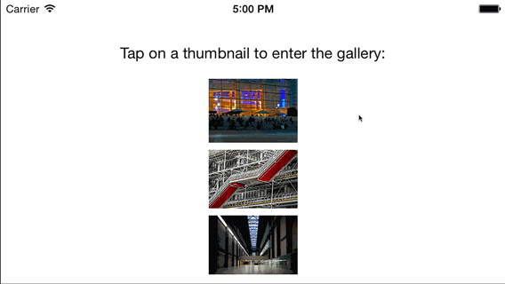

RMGallery
=========
[](http://cocoadocs.org/docsets/RMGallery) [](http://cocoadocs.org/docsets/RMGallery) [](https://travis-ci.org/robotmedia/RMGallery)

A modular and lightweight gallery for iOS.



RMGallery is a Photos-like gallery with no dependencies that can be used at view controller, view or cell level. It supports asynchronous image loading, view controller transitions, gestures and zooming.

##Features

* Displays a slideshow of images like the Photos app.
* Supports landscape and portrait orientations and handles rotations.
* Manages optional gestures to zoom, browse, toggle bars and dismiss.
* Encourages asynchronous image loading.
* Provides view controller transitions.
* Modular and extensible design.

##Installation

Using [CocoaPods](http://cocoapods.org/):

```ruby
pod 'RMGallery', '~> 0.1'
```

Alternatively, you can simply add the files from the [RMGallery](https://github.com/robotmedia/RMGallery/tree/master/RMGallery) directory to your project.

##Classes

RMGallery handles the boilerplate of a gallery UI so you can focus in theming and implementing your custom layout. RMGallery can be used at cell, view or view controller level, each one with its own corresponding class.

###RMGalleryCell

[`RMGalleryCell`](https://github.com/robotmedia/RMGallery/blob/master/RMGallery/RMGalleryCell.h) is a collection view cell that displays an image with zoom and panning. It keeps the image centered when smaller than the cell and sets appropiate values for the zoom scale. Zoom can be toggled on and off at specific points.

The cell also has its own activity indicator view, which is animated by `RMGalleryView` while it waits for the image.

###RMGalleryView

[`RMGalleryView`](https://github.com/robotmedia/RMGallery/blob/master/RMGallery/RMGalleryView.h)  is a collection view of gallery cells in a flow layout. It has a data source (`RMGalleryViewDataSource`) that is responsible for providing images and a delegate (`RMGalleryViewDelegate`) that is notified of index changes. 

The gallery view provides gestures for zooming (double tap, pinch) and browse forward/back (swipes). All gesture recognizers are exposed so you can disable or tweak them as needed.

The `RMGalleryViewDataSource` is different than `UITableViewDataSource` and `UICollectionViewDataSource` in that you can provide images to it asynchronously. This allows you to load images as you need them.

Since `RMGalleryView` is a `UICollectionView` subclass, you also get all the benefits of a collection view. Particularly, you can manage selection and highligting via `UICollectionViewDelegate` and layout via `UICollectionViewDelegateFlowLayout`.

To display a full-screen gallery it's best to use `RMGalleryViewController`. If you don't need full-screen, you can use `RMGalleryView` directly.

###RMGalleryViewController

[`RMGalleryViewController`](https://github.com/robotmedia/RMGallery/blob/master/RMGallery/RMGalleryViewController.h) is a view controller that manages a gallery view and, much like its counterparts `UITableViewController` and `UICollectionViewController`, is designed to be subclassed.

The gallery view controller gracefully handles device rotation, toggles the visibility of the status bar, navigation bar and toolbar and notifies of its own dismissal.

###RMGalleryTransition

[`RMGalleryTransition`](https://github.com/robotmedia/RMGallery/blob/master/RMGallery/RMGalleryTransition.h) is a default view controller transition to go from a thumnail to the gallery view controller and back, as shown in the animation above. To use it you only need to to provide the position and image of the originating thumbnail (typically, an `UIImageView`).

##Requirements

RMGallery requires iOS 7.0 or above and ARC.

##Roadmap

RMGallery is in initial development and its public API should not be considered stable.

##License

 Copyright 2014 [Robot Media SL](http://www.robotmedia.net)
 
 Licensed under the Apache License, Version 2.0 (the "License");
 you may not use this file except in compliance with the License.
 You may obtain a copy of the License at
 
 http://www.apache.org/licenses/LICENSE-2.0
 
 Unless required by applicable law or agreed to in writing, software
 distributed under the License is distributed on an "AS IS" BASIS,
 WITHOUT WARRANTIES OR CONDITIONS OF ANY KIND, either express or implied.
 See the License for the specific language governing permissions and
 limitations under the License.

Sample photos:

* "[Macba](https://www.flickr.com/photos/slapbcn/1832096812)" by Ramon Llorensi
* "[Pompidou Museum](https://www.flickr.com/photos/bobjagendorf/5965149738)" by Bob Jagendorf
* "[Tate Modern](https://www.flickr.com/photos/aguichard/13009663094)" by Aurelien Guichard
